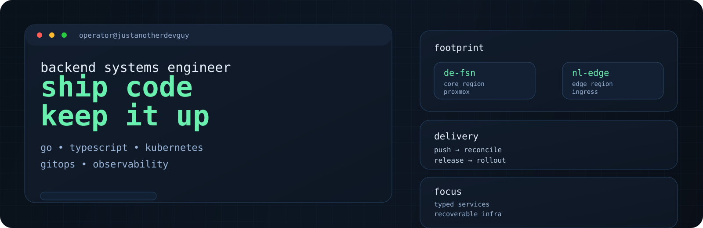
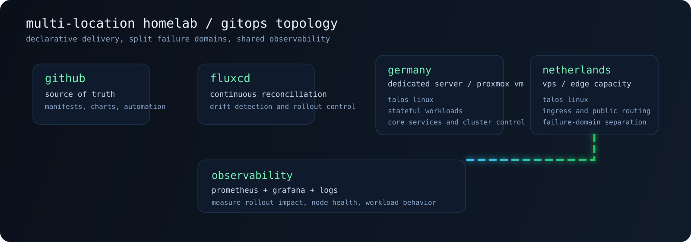
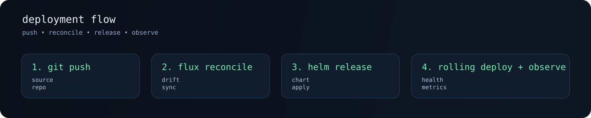

<div align="center">
  
</div>

## About

I build backend systems, ship APIs that stay maintainable under pressure, and run self-hosted infrastructure with the same bias toward reliability.

Most of my work sits somewhere between:

- Go and TypeScript services
- PostgreSQL, Redis, and message-driven backend flows
- Kubernetes, GitOps, and Linux-heavy infrastructure
- automation, observability, and operational cleanup

I care less about trend-chasing and more about building systems that are easy to reason about at 03:00.

## Infrastructure

My main lab is a multi-location Talos Linux Kubernetes setup spread across Germany and the Netherlands, managed declaratively through FluxCD.

<div align="center">
  
</div>

`GitHub -> FluxCD -> Germany / Netherlands -> Observability`

### Operating Principles

- Everything important should be declarative, versioned, and recoverable
- Services should be observable before they become business-critical
- Self-hosting is only worth it if the maintenance story is clean
- High availability matters, but so does keeping the system understandable

### Infrastructure Stack


## Deployment Flow

<div align="center">
  
</div>

`push -> reconcile -> release -> observe`

```yaml
apiVersion: helm.toolkit.fluxcd.io/v2
kind: HelmRelease
metadata:
  name: api
  namespace: production
spec:
  interval: 5m
  chart:
    spec:
      chart: api
      sourceRef:
        kind: HelmRepository
        name: internal
  values:
    replicaCount: 3
    ingress:
      enabled: true
    resources:
      requests:
        cpu: 100m
        memory: 128Mi
```

## Backend

I prefer backend code that is explicit, typed, and operationally boring in the best possible way.

### What I Usually Build

- HTTP APIs in Go and TypeScript
- internal tooling and automation services
- auth-aware dashboard backends
- job runners, workers, and event-driven glue
- infrastructure-facing tooling for deployment and maintenance

### Backend Stack


```go
package api

import (
	"encoding/json"
	"net/http"
	"time"
)

type HealthResponse struct {
	Status    string    `json:"status"`
	Service   string    `json:"service"`
	Timestamp time.Time `json:"timestamp"`
}

func HealthHandler(w http.ResponseWriter, r *http.Request) {
	w.Header().Set("Content-Type", "application/json")
	w.WriteHeader(http.StatusOK)

	_ = json.NewEncoder(w).Encode(HealthResponse{
		Status:    "ok",
		Service:   "edge-api",
		Timestamp: time.Now().UTC(),
	})
}
```

```ts
import { z } from "zod";

const createProjectSchema = z.object({
  name: z.string().min(3).max(64),
  visibility: z.enum(["private", "public"]),
});

type CreateProjectInput = z.infer<typeof createProjectSchema>;

export async function createProject(input: unknown): Promise<CreateProjectInput> {
  return createProjectSchema.parse(input);
}
```

## Current Focus

- hardening infra and keeping GitOps workflows clean
- getting deeper into Rust without forcing it into the wrong problems
- improving backend ergonomics around validation, logging, and observability
- reducing manual operations through automation wherever possible

## Tooling

Daily driver setup stays pretty predictable:

- ThinkPad
- CachyOS / Arch-based Linux
- Git, terminal-first workflows, and editors that do not get in the way
- strong preference for owning the stack rather than renting every layer

## Philosophy

```bash
ship_small_changes
measure_everything
automate_the_boring_parts
keep_the_stack_understandable
prefer_reliability_over_hype
```
